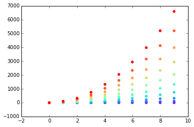

Title: Jupyter
Date: 2017-08-05 4:33
Modified: 2017-08-05 4:33
Category: Python
Tags: pelican, publishing, Jupyter
Slug: Notebook
Authors: Eliot Logan
Summary: Short version for index and feeds

```python
%matplotlib inline  
import pandas as pd
import numpy as np
import matplotlib.pyplot as plt
import matplotlib.cm as cm
```


```python
x = np.arange(10)
ys = [i+x+(i*x)**2 for i in range(10)]

colors = cm.rainbow(np.linspace(0, 1, len(ys)))
for y, c in zip(ys, colors):
    plt.scatter(x, y, color=c)
    
```

    /Users/eliot/anaconda/lib/python2.7/site-packages/matplotlib/collections.py:590: FutureWarning: elementwise comparison failed; returning scalar instead, but in the future will perform elementwise comparison
      if self._edgecolors == str('face'):





```python

```
